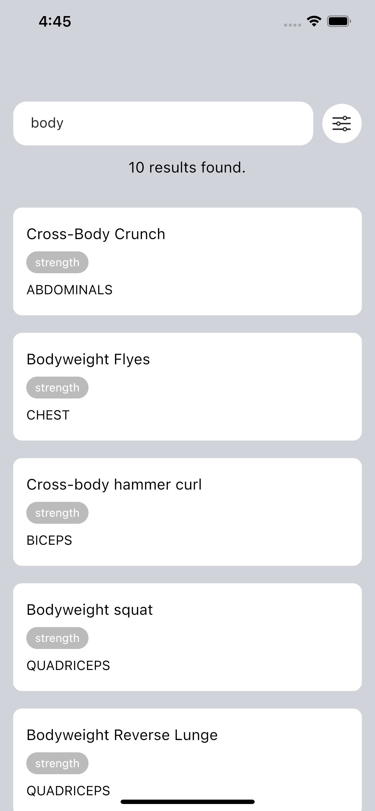
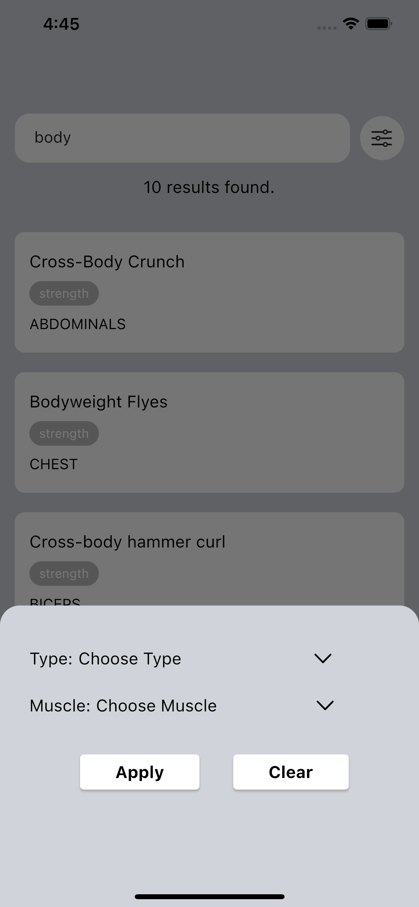
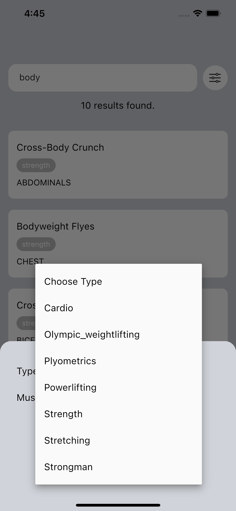
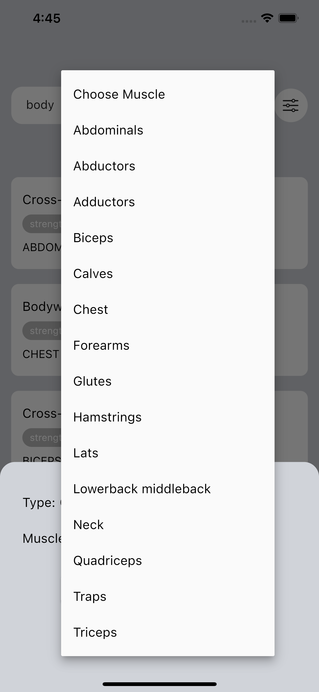

# Exercises Case App

Exercises App, flutter ile yazılmıştır. Rapid Api üzerinden gelen verilerde, ekzersiz arama ve filtreme özellikleri bulunmaktadır. 

    
 
# Library | Use
 flutter_dotenv: ^5.0.2
 get: ^4.6.5
 http: ^0.13.5

-> Assistanapp

